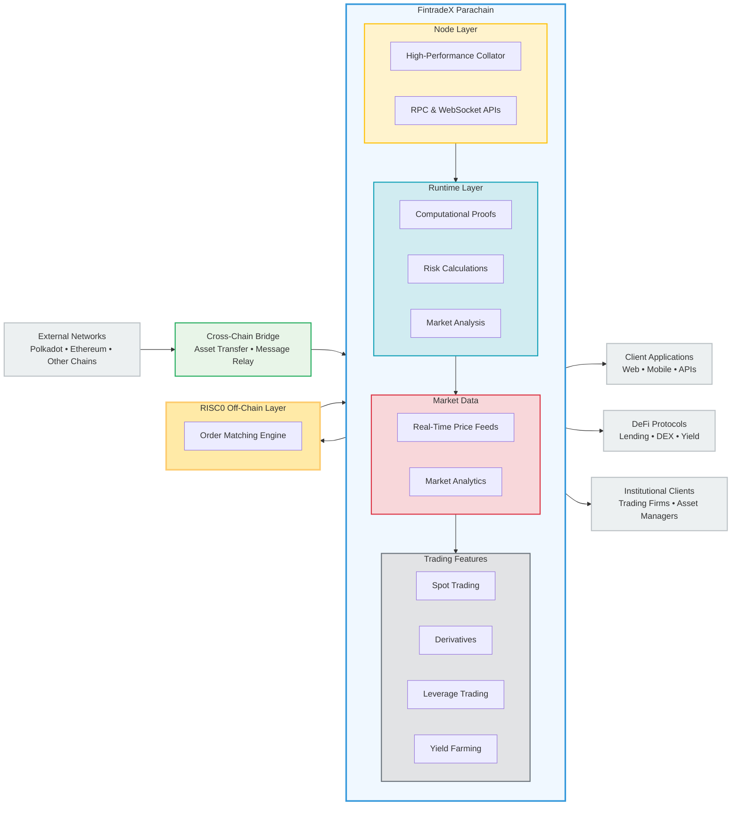

# FintradeX Parachain

> **The Future of Decentralized Financial Trading on Polkadot**

**A high-performance, cross-chain decentralized trading platform built on Polkadot**

## 🚀 About FintradeX

FintradeX is revolutionizing decentralized finance by creating the most advanced trading infrastructure on Polkadot. We're building a platform that combines the speed and efficiency of traditional financial markets with the transparency and accessibility of blockchain technology.

### 🎯 Our Mission
- **Democratize Trading**: Make professional-grade trading tools accessible to everyone
- **Cross-Chain Liquidity**: Unify liquidity across multiple blockchain networks
- **Institutional-Grade Infrastructure**: Provide enterprise-level trading capabilities
- **Community-Driven Governance**: Empower users to shape the future of DeFi trading

## 🏗️ Architecture

*FintradeX Architecture - High-Performance Cross-Chain Trading Platform with RISC0 Off-Chain Processing*

The FintradeX parachain consists of:

- 🧮 **[Runtime](./runtime/README.md)** - The core trading logic and state management
- 💿 **[Node](./node/README.md)** - High-performance blockchain node for trading operations
- 🔗 **Cross-Chain Bridge** - Seamless asset transfer between blockchains
- 📊 **Market Data Engine** - Real-time price feeds and market analytics
- 🛡️ **Security Layer** - Advanced security and risk management systems
- ⚡ **RISC0 Off-Chain Layer** - High-performance order matching and computational proofs

## 🌟 Key Features

### 🏦 Advanced Trading Infrastructure
- **Multi-Asset Trading**: Trade any asset across multiple blockchains
- **High-Frequency Trading**: Sub-second order execution with minimal latency
- **Advanced Order Types**: Limit, market, stop-loss, and conditional orders
- **Real-Time Market Data**: Live price feeds and market analytics
- **Liquidity Pools**: Automated market making with deep liquidity

### 🔗 Cross-Chain Capabilities
- **Unified Trading Experience**: Trade assets from any connected blockchain
- **Seamless Asset Transfers**: Instant cross-chain asset movement
- **Interoperable Liquidity**: Share liquidity across the entire Polkadot ecosystem
- **Multi-Chain Order Books**: Unified order books across multiple networks

### 🛡️ Security & Compliance
- **Institutional-Grade Security**: Enterprise-level security protocols
- **Regulatory Compliance**: Built-in compliance features for institutional adoption
- **Audit-Ready Infrastructure**: Transparent and auditable trading operations
- **Risk Management**: Advanced risk controls and position monitoring

### 🏛️ Governance & Economics
- **DAO Governance**: Community-driven protocol decisions
- **Fee Distribution**: Fair and transparent fee sharing mechanisms
- **Staking Rewards**: Earn rewards by participating in network security
- **Treasury Management**: Community-controlled development funding

## 📊 Trading Features

### Spot Trading
- **Instant Settlement**: T+0 settlement for all trades
- **Deep Liquidity**: Access to liquidity across multiple chains
- **Advanced Charts**: Professional-grade trading charts and indicators
- **Portfolio Management**: Comprehensive portfolio tracking and analytics

### Derivatives Trading
- **Futures & Options**: Advanced derivative instruments
- **Leverage Trading**: Flexible margin trading with risk controls
- **Synthetic Assets**: Trade any asset as synthetic derivatives
- **Risk Hedging**: Advanced hedging strategies and tools

### DeFi Integration
- **Yield Farming**: Earn rewards through liquidity provision
- **Staking Protocols**: Participate in various staking opportunities
- **Lending & Borrowing**: Access to decentralized lending markets
- **Insurance Products**: Protect against smart contract risks

## 📚 Documentation

- [Runtime Documentation](./runtime/README.md) - Core trading logic and state management
- [Node Documentation](./node/README.md) - High-performance blockchain node

## 🤝 Contributing

We welcome contributions from the community! Please read our [Contributing Guidelines](./CONTRIBUTING.md) before submitting pull requests.

## 📄 License

This project is licensed under the Apache License 2.0 - see the [LICENSE](LICENSE) file for details.

## 🌐 Links

- **Website**: [https://fintradex.io/](https://fintradex.io/)
- **Discord**: [https://discord.gg/fintradex](https://discord.gg/fintradex)
- **Twitter**: [https://twitter.com/fintradex](https://twitter.com/fintradex)
- **Telegram**: [https://t.me/fintradex](https://t.me/fintradex)

## 🙏 Acknowledgments

- [Polkadot](https://polkadot.network/) - The foundation for cross-chain interoperability
- [Substrate](https://substrate.io/) - The blockchain development framework
- [Parity Technologies](https://www.parity.io/) - The team behind Polkadot and Substrate

---

**Built with ❤️ by the FintradeX Team**

 